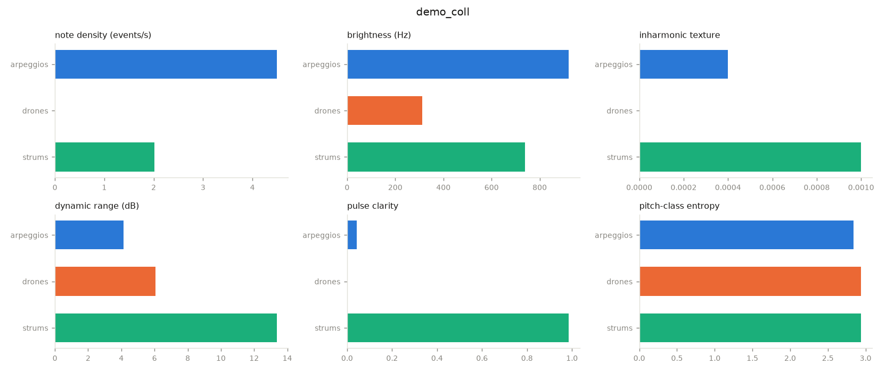

# Musiscape

[](https://github.com/fourMs/musiscape/actions/workflows/ci.yml)
[](https://fourms.github.io/musiscape/)
[](https://pypi.org/project/musiscape/)
[](https://pypi.org/project/musiscape/)
[](LICENSE)
[](https://doi.org/10.5281/zenodo.21948999)

Musiscape is a Python toolbox that analyses a folder tree of music as a
collection: albums, similarity, outliers, categories. Point it at a folder
of audio files—each subfolder counts as an album—and it renders figures,
tables and thumbnails that let you compare many tracks at a glance.

## Install

```bash
pip install musiscape
```

## Quickstart

```bash
musiscape report ~/Music/my-collection
```

One command runs the whole pipeline and writes `analysis/README.md` next to
your music: an album table, a similarity landscape, self-explaining
categories, and the corpus extremes.



## Commands

| Command | What it does |
|---|---|
| `probe` | list albums and tracks, no analysis |
| `extract` | per-track features, cached in `features.json` |
| `fingerprint` | per-album profile bars |
| `landscape` | PCA similarity map and album-affinity matrix |
| `categorize` | k-means categories with named signatures |
| `report` | everything above, gathered into `analysis/README.md` |
| `thumbnails` | one visual card per track (`--style`, seventeen styles) |
| `poster` | the whole collection as one image (`--style vinyl` for discs) |
| `sonic` | a ~12-second audio summary per track, plus album medleys |

Common options: `-o` sets the output folder (default `<root>/analysis`),
`--workers N` parallelises, `--duration S` analyses only the first S seconds
per track, and `-k` fixes the number of categories.

## Learn more

- [Documentation](https://fourms.github.io/musiscape/)—guides, an
  illustrated gallery of the visualisation styles, and the API reference
- [Wiki](https://github.com/fourMs/musiscape/wiki)—methodology notes and a
  case study

The toolbox is meant for quick visualisations and overviews. Combine it
with listening.

## Related toolboxes

These toolboxes come out of the [fourMs lab](https://github.com/fourMs) at
the University of Oslo. They are separate packages with separate release
cycles, but they are built to be used together and share several
implementations, so a measure computed in one agrees with the same measure
computed in another.

- [Musical Gestures Toolbox](https://github.com/fourMs/MGT-python)
  (`musicalgestures`)—video and audio: motiongrams, videograms, and motion
  analysis from ordinary video files
- [ambiscape](https://github.com/fourMs/ambiscape)—soundscapes: the sonic
  ambience of a place; musiscape reuses its circular statistics and
  Schaeffer typology machinery
- [micromotion](https://github.com/fourMs/micromotion)—human micromotion:
  quantity of motion from optical markers, accelerometers, respiration
  belts and force plates

## Licence and credit

MIT licence. Musiscape is developed as part of the
[AMBIENT](https://www.uio.no/ritmo/english/projects/ambient/) project at
[RITMO Centre for Interdisciplinary Studies in Rhythm, Time and
Motion](https://www.uio.no/ritmo/english/), University of Oslo.

## Citing

Cite the CONCEPT DOI, which always resolves to the newest version:

> Jensenius, A. R. (2026). *musiscape: analysis of music collections* (Version 0.5.0) [Computer software]. Zenodo.
> https://doi.org/10.5281/zenodo.21948999

Where the exact behaviour matters, cite the version you ran instead. Version 0.5.0 is https://doi.org/10.5281/zenodo.21949000.

`CITATION.cff` in this repository carries the same information in machine-readable form.
