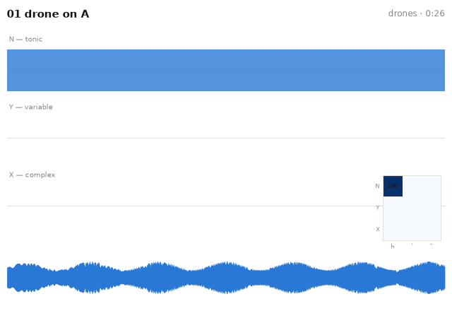
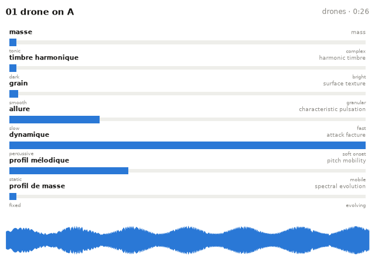

# Schaeffer cards (TARTYP & TARSOM)

Pierre Schaeffer's *Traité des objets musicaux* summarises its analysis in
two tables, and musiscape renders a per-track card for each:

## `schaeffer` — the typology (TARTYP)

Each track is segmented into onset-bounded *sound objects* and every object
classified on a simplified TARTYP grid: **mass** N (tonic) / Y (variable) /
X (complex) from spectral flatness and centroid drift, **facture** held /
impulse (′) / iteration (″) from duration and 4–20 Hz envelope modulation.
The card draws the objects on three mass lanes (ticks = impulses, hatching
= iterations, solid blocks = held) with a TARTYP duration-share grid inset:

Segmentation and thresholds are shared with
`ambiscape.music.tartyp_profile`, so the cards always agree with the
statistics. The simplified grid covers Schaeffer's central *balanced*
objects; the full table's redundant and eccentric classes (homogeneous
drones, pedals, large objects) are a planned extension.

## `tarsom` — the morphology (TARSOM)

The *Tableau récapitulatif du solfège des objets musicaux* summarises seven
morphological criteria. The card shows the track's measured position on
each, as gauges with anchored class scales:

| Criterion | Proxy | Scale |
|---|---|---|
| masse | median spectral flatness | tonic ↔ complex |
| timbre harmonique | spectral centroid | dark ↔ bright |
| grain | 20–100 Hz envelope modulation share | smooth ↔ granular |
| allure | 0.5–8 Hz envelope modulation peak | slow ↔ fast |
| dynamique | median onset-to-peak attack time | percussive ↔ soft onset |
| profil mélodique | dominant-pitch changes per second | static ↔ mobile |
| profil de masse | spectral-flatness evolution | fixed ↔ evolving |

## Honesty

These are **signal proxies for aural categories**. Schaeffer's typology and
morphology are acts of *reduced listening*; a threshold on spectral flatness
is not. The proxies were calibrated on tonal instrumental corpora, and the
scales on the TARSOM card reflect that calibration. In the tradition of
Lasse Thoresen's aural sonology — where the analyst hears and then notates —
treat these cards as machine-made *drafts for the ear*: a place to start
listening, and to disagree with.
