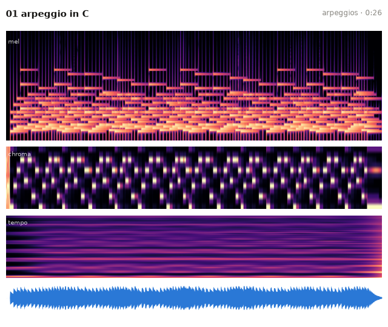
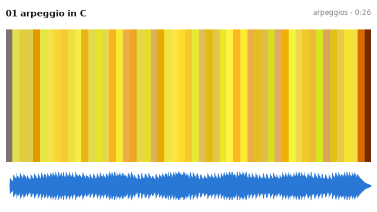
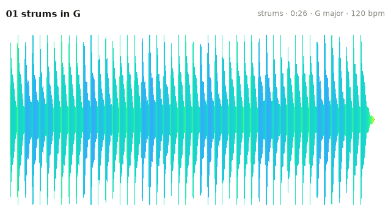
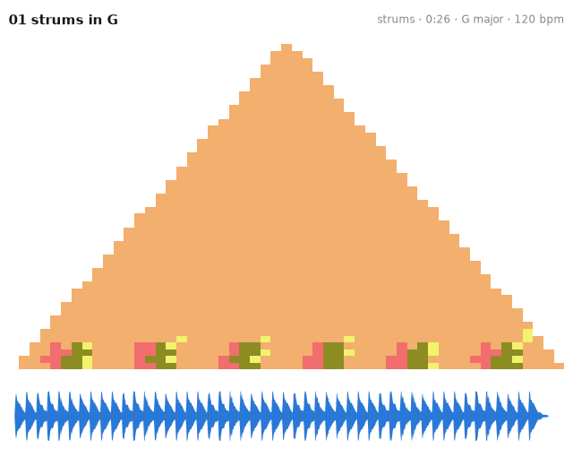
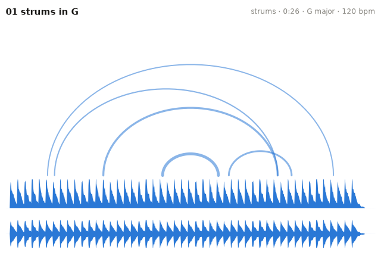
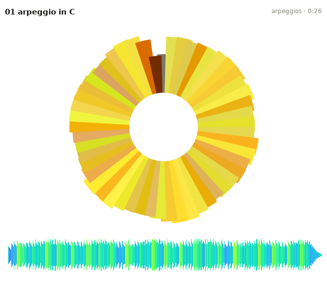
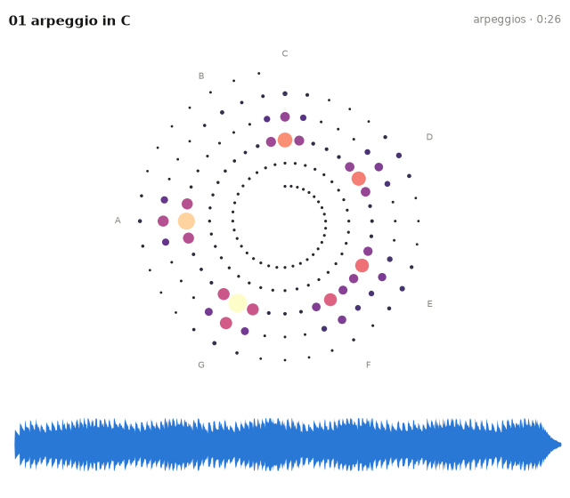
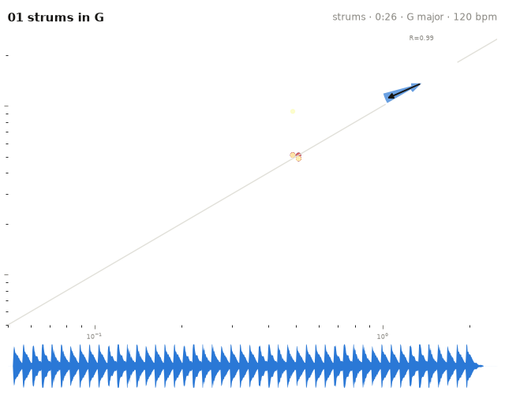
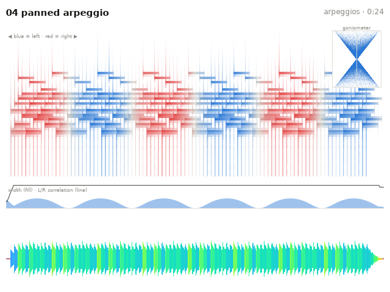
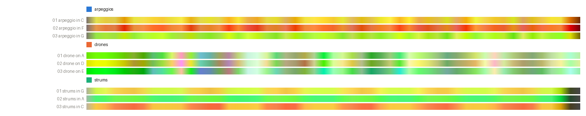

# Visual thumbnails & posters

Every track becomes one card: a main representation, a title bar (track,
album, duration, key · bpm when a `features.json` exists), and a waveform
strip. Seventeen styles, chosen with `--style`; albums additionally get
contact sheets. All examples below are rendered from a small synthetic
demo collection (arpeggios, drones, strummed chords).

```bash
musiscape thumbnails <folder> --style combo
```

## Spectrogram family

`mel` (default) — timbre and texture; `chroma` — harmony over time;
`tempo` — rhythmic periodicity; `combo` — all three stacked:



## Color codes

`barcode` — each moment's hue is its position on the circle of fifths,
saturation its tonal focus, brightness its loudness:



`wave` — Freesound-style: the amplitude envelope colored by spectral
centroid (dark blue = dark timbre, red = bright):



## Structure

`ssm` — self-similarity matrix: musical form as texture.
`keyscape` — Sapp-style triangle: every window at every time scale
colored by its key (hue = tonic on the fifths circle, light = major,
dark = minor). `arcs` — Shape-of-Song repetition arcs:




## Circular forms

`vinyl` — the track as a tonality disc (one revolution, harmony as hue,
loudness as radius) with the Freesound waveform underneath. `spiral` —
time-integrated energy on the Shepard helix (angle = pitch class, radius =
octave — the only view that shows register). `tonnetz` — the harmony's
path on the circle-of-fifths plane:




## Rhythm

`rhythm` — a Poincaré portrait of successive inter-onset intervals
(metric playing collapses to points, rubato spreads into clouds), with a
beat-wheel inset: onset phases on the dominant-period circle and the
pulse-clarity resultant arrow:



## Stereo field

`stereo` — where the music sits in the stereo image: a pan-by-frequency
spectrogram (blue = left, red = right, ink strength = energy) with a
goniometer inset, over a smoothed width-and-correlation timeline. Mono
recordings degrade gracefully. For multichannel and ambisonic material,
use [ambiscape](https://github.com/fourMs/ambiscape)'s spatial analysis.



## Schaeffer cards

See [Schaeffer cards](schaeffer.md) for the `schaeffer` (TARTYP) and
`tarsom` styles.

## Posters

```bash
musiscape poster <folder>                 # stacked harmony barcodes
musiscape poster <folder> --style vinyl   # grid of tonality discs
```



Albums read as color families: a harmonically coherent album shares hues, a
wandering one doesn't, and weakly tonal material (drones) washes out to low
saturation.
