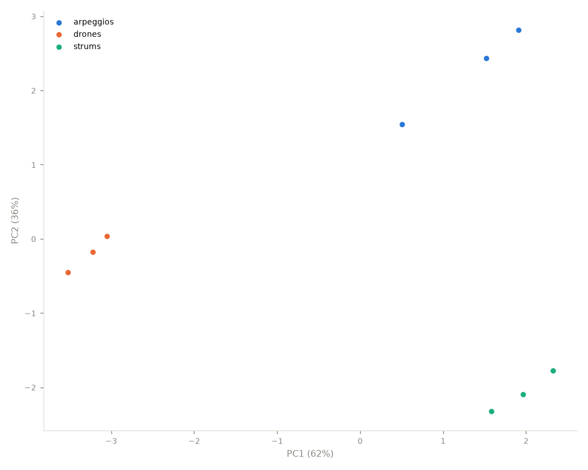
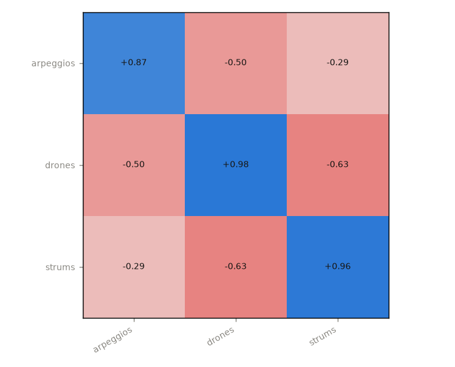

# Quickstart

A *collection* is simply a folder tree — every subfolder holding audio files
(wav/mp3/flac/ogg/m4a) becomes an album, every file a track. No metadata
tags required: the folder structure people already keep their music in is
the ground truth.

```bash
musiscape probe       ~/Music/my-collection    # what's here?
musiscape report      ~/Music/my-collection    # everything → analysis/README.md
musiscape fingerprint ~/Music/my-collection    # per-album profile bars
musiscape landscape   ~/Music/my-collection    # PCA map + affinity matrix
musiscape categorize  ~/Music/my-collection    # k-means with named signatures
musiscape thumbnails  ~/Music/my-collection --style combo
musiscape poster      ~/Music/my-collection    # collection barcode poster
```

Everything lands in `<collection>/analysis/` by default (`-o` overrides).
Feature extraction is cached in `features.json` — delete it to force
re-extraction. `--workers N` parallelises; `--duration S` analyses only the
first S seconds per track.

`report` produces a per-collection `README.md` with an album table,
overview figures, self-explaining categories, and the corpus extremes:




## In Python

```python
import musiscape
from musiscape import features, corpus, categorize, thumbnails

coll = musiscape.open_collection("~/Music/my-collection")
f = features.load_features(features.extract_collection(coll, "analysis"))

corpus.album_stats(f)      # per-album fingerprints
corpus.similarity(f)       # track matrix + album affinity/consistency
corpus.landscape(f)        # PCA coords, variance, loadings
corpus.tonal_spread(f)     # key-space clustering per album (circular)
categorize.cluster(f)      # interpretable categories
thumbnails.render_collection(coll, "analysis", style="vinyl")
```
